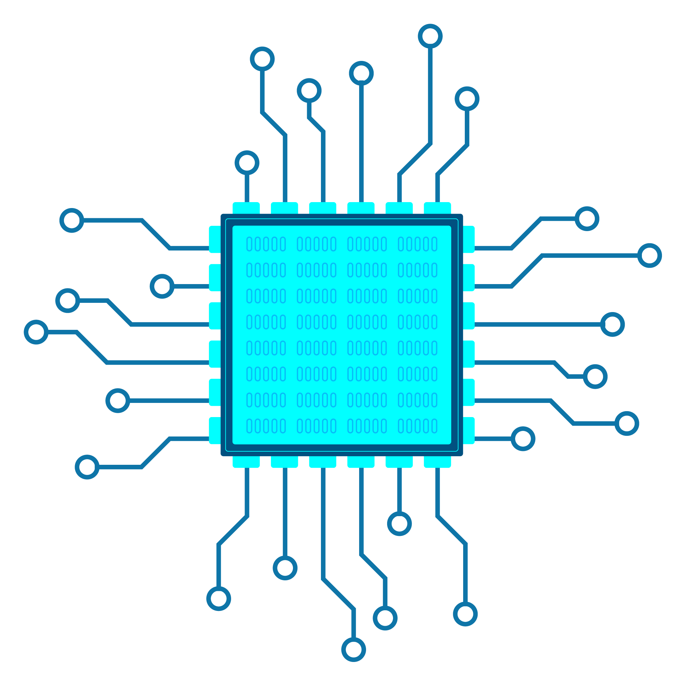

<!-- PROJECT LOGO -->
<br />
<div align="center">
  <a href="https://github.com/KobaltBlu/MOS6502">
    
  </a>

  <h3 align="center">MOS6502 CPU Project</h3>

  <p align="center">
    This is a WIP and very incomplete!!!
    <br/>
    <br/>
    
  </p>
</div>

## Install
```powershell
npm install
```
<br />

## How To Run (PowerShell)
```powershell
clear; npm run build; clear; node dist/bundle.js
```
<br />

## How To Run (Shell)
```powershell
clear && npm run build && clear && node dist/bundle.js
```
<br/>

## License

[GPL 3.0 (GNU General Public License)](LICENSE.md)